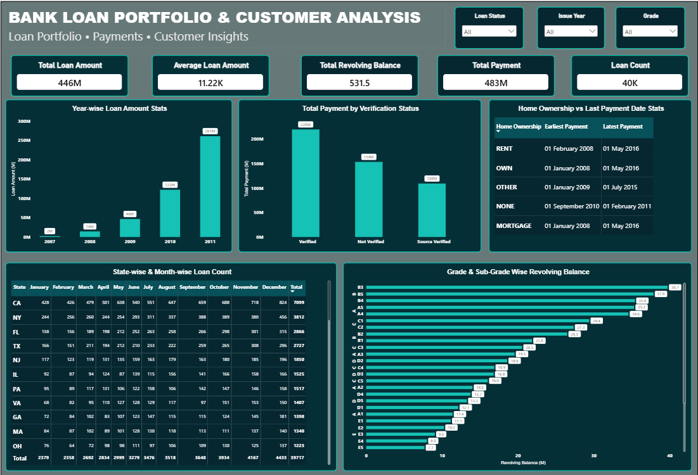

# 🏦 Bank Loan Portfolio & Customer Analysis

## 📌 Business Problem

The bank has a large loan dataset containing information about loan amounts, payments, customers, verification status, loan grades, states, and home ownership. The dashboard provides an interactive way to monitor loan portfolio and payment patterns.

## 🎯 Objective

Build an interactive Power BI dashboard to analyze loan portfolio performance, payment behavior, customer characteristics, and loan grade patterns.

## 🛠️ Tools Used

- Power BI
- Power Query
- DAX
- Data Visualization

## 📊 Key KPIs

- Total Loan Amount
- Average Loan Amount
- Total Revolving Balance
- Total Payment
- Loan Count

## 📈 Key Analysis

- Year-wise Loan Amount
- Total Payment by Verification Status
- Home Ownership vs. Last Payment Date
- State-wise & Month-wise Loan Count
- Grade & Sub-Grade Wise Revolving Balance

## 🔎 Interactive Filters

- Loan Status
- Issue Year
- Grade

## 💡 Business Questions

- How has the loan portfolio changed over the years?
- How do payments vary by verification status?
- How does revolving balance vary across loan grades and sub-grades?
- How does loan count vary across states and months?
- How do payment dates differ across home ownership categories?

## 📷 Dashboard

---

### 👩‍💻 Project By

**Anusha Edara**

[LinkedIn](www.linkedin.com/in/anusha-edara-293308161)
