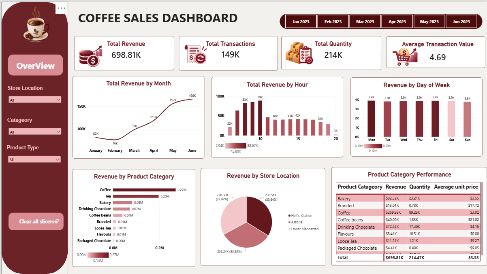

# ☕ Coffee Shop Sales Analysis Dashboard

## 📌 Business Problem

The coffee shop has transactional sales data, but it needs an easy way to understand sales performance, product performance, store performance, and sales trends.

## 🎯 Objective

Build an interactive Power BI dashboard to analyze sales data and provide a clear view of business performance.

## 🛠️ Tools Used

- Power BI
- Power Query
- DAX
- Data Visualization

## 📊 Key KPIs

| KPI | Value |
|---|---:|
| Total Revenue | $698.81K |
| Total Transactions | 149K+ |
| Total Quantity Sold | 214K+ |
| Average Transaction Value | $4.69 |

## 📈 Analysis

The dashboard analyzes:

- Revenue by Month
- Revenue by Hour
- Revenue by Day of Week
- Revenue by Product Category
- Revenue by Store Location
- Product Category Performance

## 🔎 Interactive Features

Users can filter the analysis using:

- Month
- Store Location
- Product Category
- Product Type

A dynamic tooltip provides additional details for each product category.

## 💡 Key Insights

- Coffee and Tea are major contributors to overall revenue.
- Sales vary across different hours and days of the week.
- Store locations can be compared using revenue performance.
- Product category analysis helps identify differences in revenue, quantity sold, and average unit price.

## 📷 Dashboard

The interactive Power BI dashboard provides a single-page overview of coffee shop sales performance.

### 👩‍💻 Project By

**Anusha Edara**

[LinkedIn](www.linkedin.com/in/anusha-edara-293308161)
